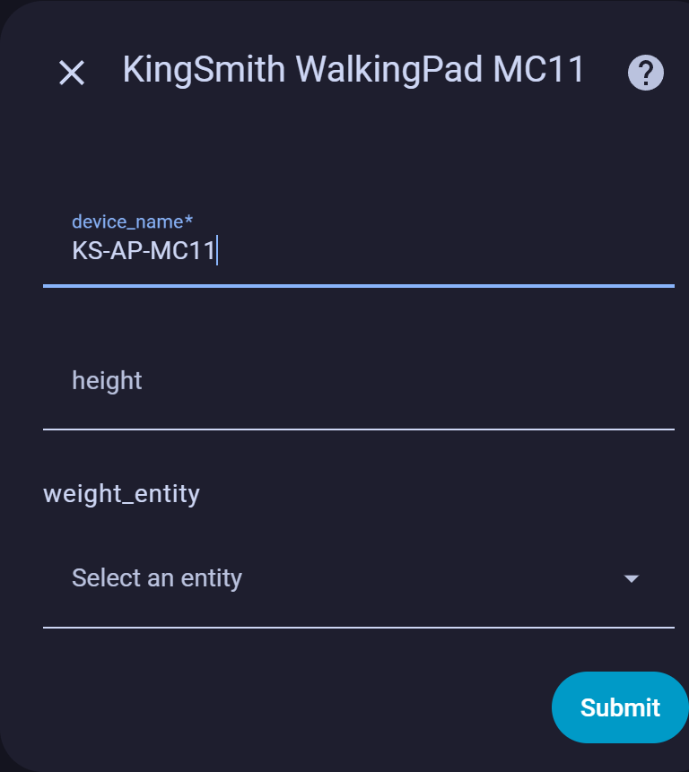
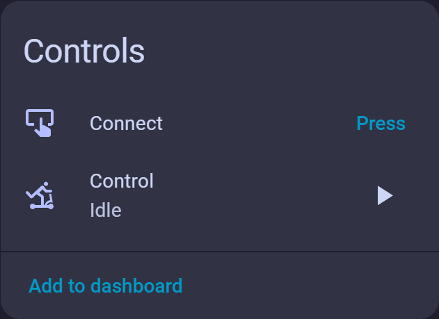
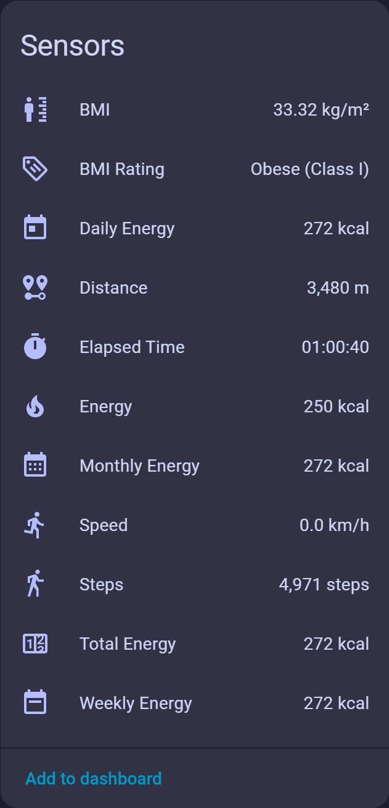

# 🏃‍♂️ Kingsmith WalkingPad Integration for Home Assistant
This custom integration brings your Kingsmith WalkingPad treadmill into the Home Assistant ecosystem, allowing you to monitor and interact with your device seamlessly.

🔧 Setup & Configuration
Upon initial setup, the integration will prompt for:

Name: Custom name for your WalkingPad instance.

Height: User's height (used for stride and distance calculations).

External Scale Entity: Optional entity picker to link a smart scale for enhanced metrics and calculating BMI.

📊 Features
The integration provides both direct and complementary sensor data:

Core Sensor Values (fetched from the device)
Speed

Distance

Time

Calories

Mode (manual/automatic)

Status (running/paused/stopped)

Complementary Sensors
Estimated steps (based on height and distance)

BMI (if external scale is linked)

Session summary statistics

🧠 Smart Automation Ideas
Automatically pause the treadmill when no weight is detected on the scale.

Trigger ambient lighting or music when a workout starts.

Log daily walking stats to a dashboard or health tracker.

📦 Installation
This integration is compatible with HACS. To install:

Add this repository to HACS as a custom integration.

Restart Home Assistant.

Configure via the Integrations UI.

📄 License
MIT License. See LICENSE file for details.
